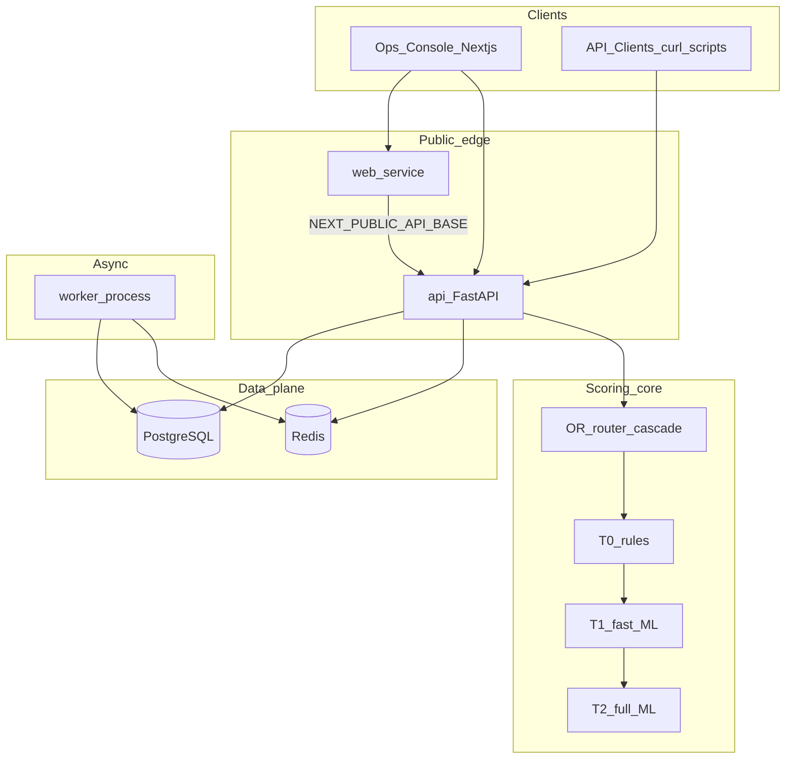

# Architecture

## System overview

Tiered Fraud Scoring Platform routes each payment through the cheapest model depth that still meets a latency budget, then persists the decision for ops review.

## Request path (score)

1. Client sends `POST /v1/score` with `X-API-Key` and optional `X-Routing-Mode`.
2. Auth + rate-limit middleware run (Redis sliding window when available).
3. OR router plans tier depth under `deadline_ms`.
4. Tiers execute (T0 → T1 → T2); optimized mode may early-exit.
5. Decision thresholds map score → `approve` / `review` / `decline`.
6. Event is written to `score_events` in Postgres and returned with `event_id`.

## Routing modes

| Mode | Behavior |
|------|----------|
| `baseline` | Always run T0→T1→T2 |
| `optimized` | Knapsack-style depth plan + cascade early exit |

## Async jobs

- Dashboard/API enqueues `batch_score` or `drift_scan` onto Redis list `fraud:jobs`.
- Worker BRPOPs jobs, updates `jobs` table, and writes scores / drift snapshots.

## Auth

- Dashboard: register/login JWT (`/v1/auth/*`), forgot-password reset tokens emailed or logged.
- Scoring: hashed API keys (`X-API-Key`).

## Deploy topology (Render)

| Service | Role | Public |
|---------|------|--------|
| Postgres | Persistence | No |
| Redis (Key Value) | Queue + rate limit | No |
| api | FastAPI + migrations | Yes |
| web | Next.js Ops Console | Yes |
| worker | Job consumer (optional, paid) | No |

See [deploy-render.md](deploy-render.md) for setup steps.
